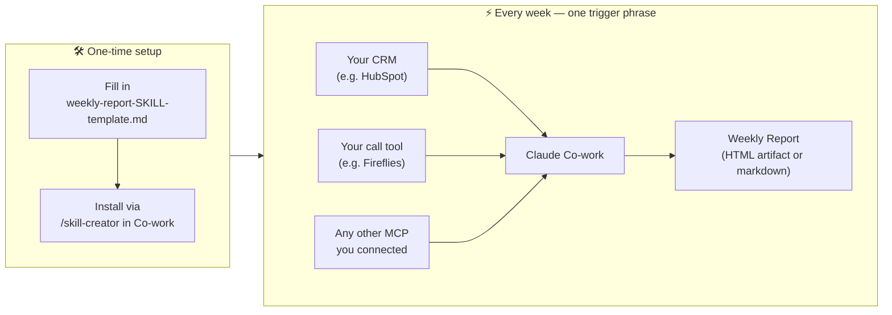

# Co-work Weekly Report Skill Template

A fill-in-the-blank skill template for building your own automated weekly report inside Claude Co-work. No extra tools, no extra subscriptions.

You give it your metrics and sources, and it works like a data analyst on top of them: it picks the right chart for each number, leads with the story, and flags what changed and why. The result reads in 30 seconds, not 30 minutes.

> This template was built as part of a YouTube tutorial. [Watch the video →](#) *(link coming soon)*

---

## What's in this repo

| File | What it is |
|---|---|
| `weekly-report-SKILL-template.md` | A structured template you fill in once to define your report — metrics, data sources, layout, and fallback rules |

---

## How it works

You fill in the template with your own metrics, data sources, and design preferences. Once complete, you install it as a skill in Co-work. After that, a single trigger phrase — whatever you defined — generates your full report automatically from your connected tools.

---

## Before you start

You need the following in place:

- **Claude Co-work** — with at least one data connector active (HubSpot, Fireflies, Google Sheets, etc.)
- **Your data sources connected** — whatever MCPs your report will pull from; connect them once via OAuth in Co-work settings
- **A clear North Star metric** — the one number your report is built around; if you can't name it, the template will prompt you

---

## How to install your skill

1. Download `weekly-report-SKILL-template.md`
2. Fill in every `[BRACKET]` placeholder — metrics, data sources, design style, fallback rules
3. Delete the comment lines (everything between `<!-- ... -->`) when you're done
4. Copy the full file contents
5. In Claude Co-work, open the **Directory** → find `/skill-creator` → install it
6. Run `/skill-creator` in chat and paste in your content
7. Name the skill (e.g. `weekly-report`) and save

That's it. Type your trigger phrase at the start of each week and your report runs.

---

## What the template covers

The template doesn't just collect numbers. It encodes the craft a good data analyst applies by reflex: choosing the right chart for each metric and leading with the story, so the report is understood in 30 seconds.

### Goal
What decision or action does this report enable? Defining this first prevents you from building a report nobody acts on.

### North Star Metric
The single metric the whole report is built around — with its calculation and why it matters.

### Accessory Metrics
3–5 supporting metrics that explain movement in the North Star.

### Data Source Mapping
A table mapping every metric to its exact source, field, and any filters, so Claude knows precisely where to pull each number.

### Visualization Guide
Which chart to use for each metric, picked by the *message* (comparison, trend, part-of-whole, distribution, relationship) rather than the data type. This is the chart-selection instinct of a data analyst, written down so Claude doesn't guess.

### Report Structure
The exact sections your report must contain, in order. It starts with a mandatory **Summary / What's Going On** written bottom-line-up-front (So What, Why, Now What), so the reader gets the takeaway before the detail. Every other section specifies its format (table, narrative, KPI card, etc.).

### Design Language
The visual style, UI library reference, and layout notes that make your report look intentional rather than default AI output. It also covers data-viz hierarchy: one dominant focal point, and chart titles that state the finding rather than the variable names.

### Output Contract
What "done" looks like: file type, delivery method, required sections checklist, tone, and length target.

### Fallback Rules
What Claude should do when a data source returns nothing, a metric can't be computed, or an MCP is unavailable.

### What This Skill Is NOT For
Hard boundaries that prevent Claude from over-reaching — no forecasting, no CRM writes, no fabricated data.

---

## Connectors vs. subscriptions

This skill uses whatever connectors you already have active in Co-work. No additional tools, no webhooks, no extra subscriptions required.

The only cost is your Claude plan and the data tools you already use.

---

## Questions or issues

Open an issue in this repo or leave a comment on the video.
